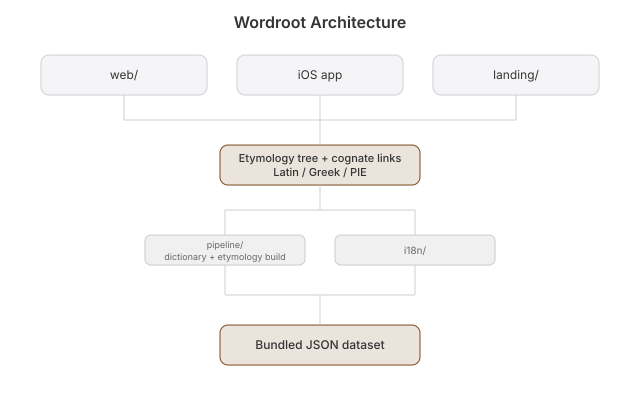

# Wordroot


Dictionary with deep etymology. Trace any word back through Latin, Greek, and Proto-Indo-European with an interactive etymology tree and cognate links.

## Why
No app combines clean dictionary UX with real etymology visualization. The big dictionary apps have ads and no etymology; the one etymology app is mediocre.

## Architecture


- **pipeline/** — Python (stdlib only) parser: Wiktionary → etymology graph → SQLite
- **ios/** — SwiftUI multiplatform (iOS + Mac), xcodegen
- **web/** — static frontend, shared dataset

## Data
Wiktionary (CC-BY-SA) parsed into a word/edge graph, WordNet fills gaps. No OED, no Etymonline text, no LLM-generated etymologies.

## Run
```sh
python3 pipeline/parse.py     # builds wordroot.sqlite from sample words
python3 pipeline/test_parse.py
```

## License
MIT © 2026 Joshua Trommel

## Whitepaper

[Technical whitepaper](WHITEPAPER.md)
